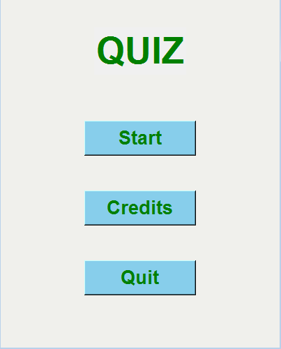

# Quiz Tkinter




> The quiz asks questions with 5 alternatives and counts the correct answers

### Adjustments and improvements

The project is still under development and the next updates will focus on the following tasks:

- [x] Add button functionality
- [x] Organize the questions and alternatives on the screen
- [x] Count the hits
- [ ] Add a timer
- [ ] Improve the interface

## 💻 Prerequisites

Before you begin, make sure you have met the following requirements:

- You have installed version 3.8.10 or higher of `Python`

## 🚀 Installing tkinter quiz
To install the quiz_tkinter, follow these steps:

Linux and macOS:

```
git clone https://github.com/SilasAndradev/quiz_tkinter.git
```

Windows:

```
git clone https://github.com/SilasAndradev/quiz_tkinter.git
```


## 📫 Contributing to quiz_tkinter

To contribute to quiz_tkinter, follow these steps:

1. Create a fork of this repository.
2. Submit your commits in Portuguese.
3. Enter a short summary of what was added.
4. Request a pull request.

Alternatively, see the GitHub documentation on [how to create a pull request](https://help.github.com/en/github/collaborating-with-issues-and-pull-requests/creating-a-pull-request).

<!--## 🤝 Colaboradores

Agradecemos às seguintes pessoas que contribuíram para este projeto:

<table>
  <tr>
    <td align="center">
      <a href="#" title="Silas Andrade">
        <br>
        <sub>
          <b>Silas Andrade</b>
        </sub>
      </a>
    </td>
  </tr>
</table>
-->
## 😄 Become a contributor

Want to be part of this project? Click [HERE](CONTRIBUTING.md) and read how to contribute.

## 📝License

This project is licensed under a license. See the [LICENSE](LICENSE.md) file for more details.